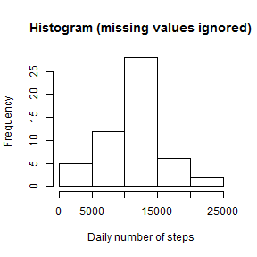
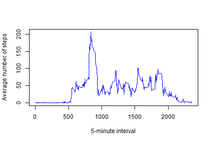
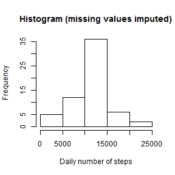
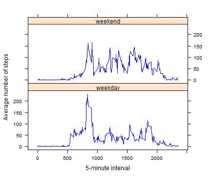

## Loading and preprocessing the data

We load the data:


```r
activity <- read.csv("activity.csv")
```

There are 17568 records in the dataset.

We convert the date variable to date format:


```r
activity$date <- as.Date(activity$date)
```

Data have been collected from 2012-10-01 to 2012-11-30.


## What is mean total number of steps taken per day?

We then compute the total number of steps taken each day (for the moment, missing values in the dataset are ignored):


```r
activity_daily_wo_na <- aggregate(steps ~ date, data = activity, sum, na.rm = T)
```

See below a histogram of the total number of steps taken each day:


```r
hist(activity_daily_wo_na$steps, xlab = "Daily number of steps", main = "Histogram (missing values ignored)")
```

 

We compute the mean and median total number of steps taken per day:


```r
mean_daily_steps_wo_na <- mean(activity_daily_wo_na$steps, na.rm = T)
median_daily_steps_wo_na <- median(activity_daily_wo_na$steps, na.rm = T)
```

The **mean** is equal to:

```
## [1] 10766.19
```

while the **median** is equal to:

```
## [1] 10765
```


## What is the average daily activity pattern?

We first compute the average number of steps taken for each 5-minute interval (missing values are ignored):


```r
activity_interval_wo_na <- aggregate(steps ~ interval, data = activity, mean, na.rm = T)
```


We then represent these values on a time-series plot:


```r
plot(activity_interval_wo_na$interval, activity_interval_wo_na$steps, 
     xlab = "5-minute interval", ylab = "Average number of steps", main = "",
     type = "l", col = "blue")
```

 

We look for the 5-minute interval with the maximum number of steps (on average across all the days in the dataset):


```r
interval_max_steps <- activity_interval_wo_na$interval[which.max(activity_interval_wo_na$steps)]
print(interval_max_steps)
```

```
## [1] 835
```


## Imputing missing values

We compute the total number of missing values in the dataset:


```r
na_count <- sum(is.na(activity$steps))
print(na_count)
```

```
## [1] 2304
```

There are 2304 missing values over 17568 records (13%).

We impute missing values with the mean for the corresponding 5-minute interval:


```r
activity_imputing <- merge(activity, activity_interval_wo_na, by = "interval", suffixes = c("", ".mean"))
activity_imputing$steps <- ifelse(is.na(activity_imputing$steps), activity_imputing$steps.mean,
                                  activity_imputing$steps)
activity_imputing <- subset(activity_imputing, select = c(steps, date, interval))
```

The dataframe "activity_imputing" is is equal to the original dataset but with the missing data filled in.

We then compute the total number of steps taken each day (missing values are now imputed):


```r
activity_daily_w_na <- aggregate(steps ~ date, data = activity_imputing, sum, na.rm = T)
```

See below the corresponding histogram of the total number of steps taken each day:


```r
hist(activity_daily_w_na$steps, xlab = "Daily number of steps", main = "Histogram (missing values imputed)")
```

 

The **mean** of the total number of steps taken per day is now equal to:


```r
mean_daily_steps_w_na <- mean(activity_daily_w_na$steps, na.rm = T)
mean_daily_steps_w_na
```

```
## [1] 10766.19
```

While the **median** is equal to:


```r
median_daily_steps_w_na <- median(activity_daily_w_na$steps, na.rm = T)
median_daily_steps_w_na
```

```
## [1] 10766.19
```

When ignoring missing values, mean and median were very close. After imputing missing values, they are equal.
By increasing the number of values used to compute the median, and putting them equal to 5-minute interval mean imputation has enforced the equilibrium of distribution.


## Are there differences in activity patterns between weekdays and weekends?

We add a new factor variable in the dataset with two levels: “weekday” and “weekend”, indicating whether a given date is a weekday or weekend day:


```r
activity_imputing$day_type <- ifelse(weekdays(activity_imputing$date) %in% c("samedi", "dimanche"),
                                     "weekend", "weekday")
```


We compute the average number of steps across all weekday days, and the average number of steps across all weekend day, for each 5-minute interval:


```r
activity_weekday <- aggregate(steps ~ day_type + interval, data = activity_imputing, mean, na.rm = T)
```


Finally, we plot the average number of steps across all weekday days, versus the average number of steps across all weekend days:


```r
library(lattice)
xyplot(steps ~ interval | day_type, data = activity_weekday, layout = c(1,2),  
       xlab = "5-minute interval", ylab = "Average number of steps",
       type = "l", col = "blue")
```

 


